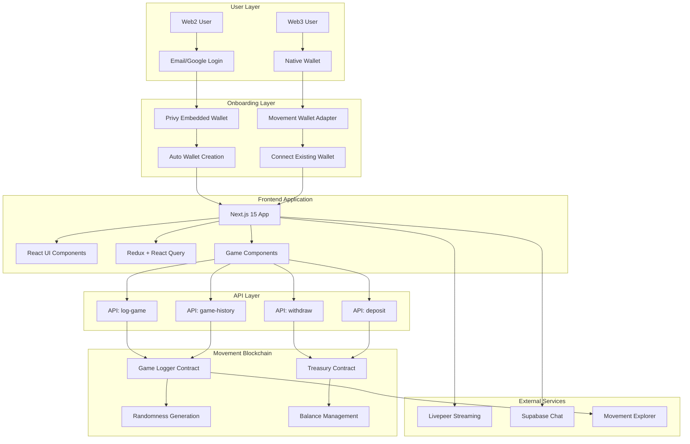
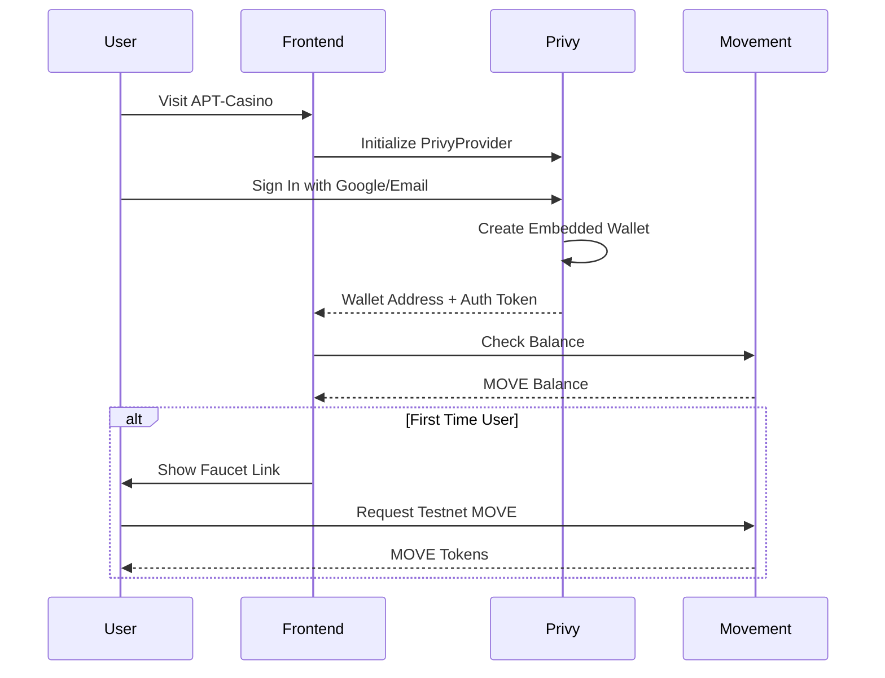
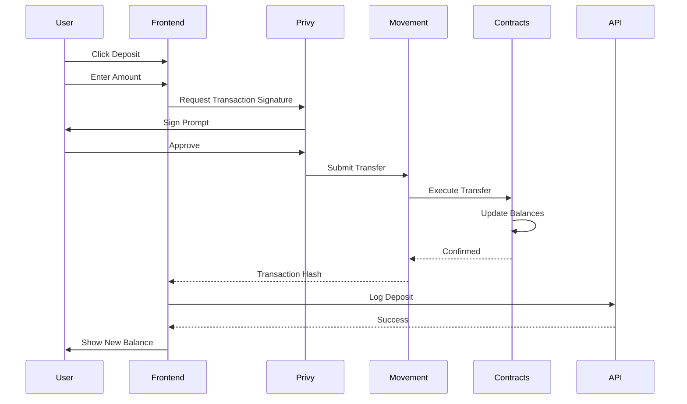
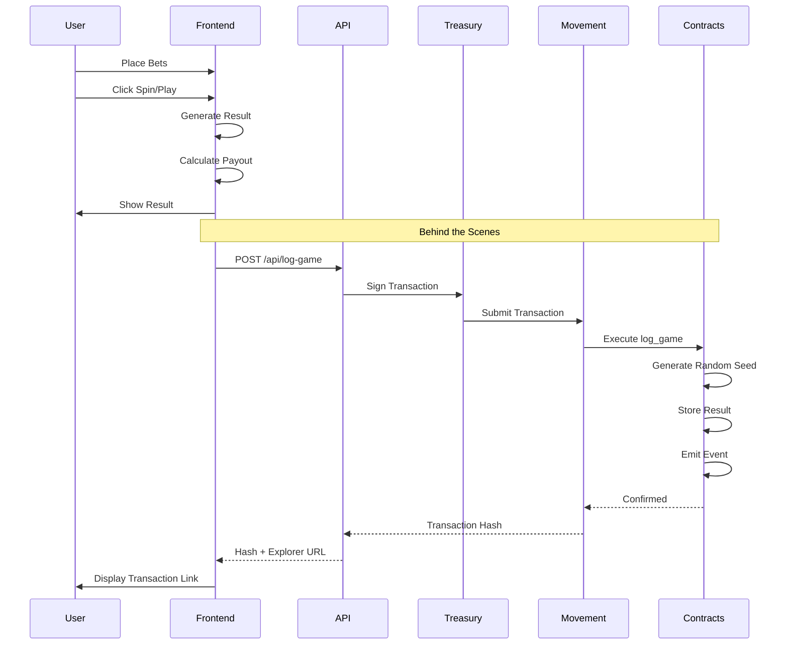
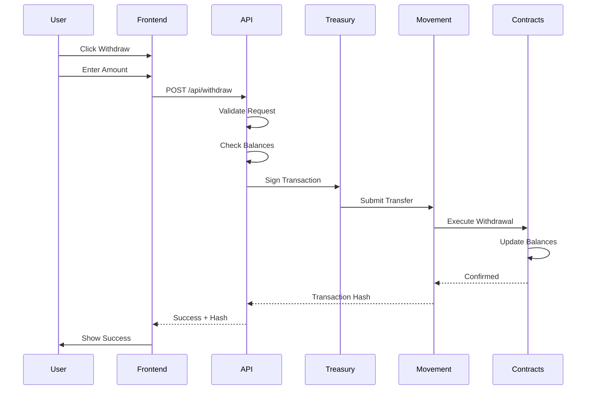
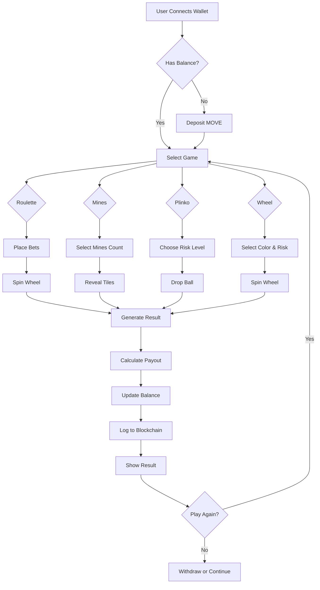
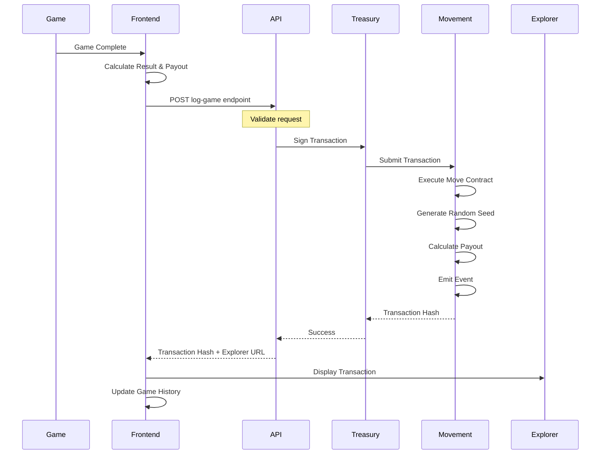
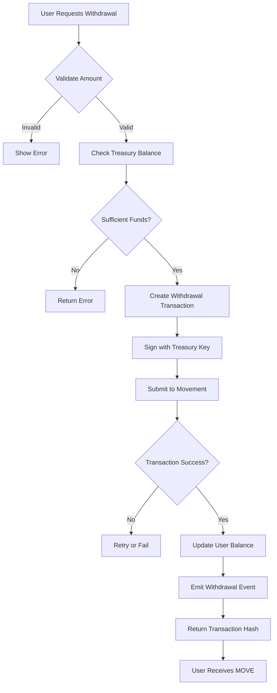

# APT-Casino

A couple of days back, I was on etherscan exploring some transactions and saw an advertisement of https://stake.com/, which was giving a 200% bonus on first deposit. I deposited 120 USDT into stake.com they gave 360 USDT as total balance in their controlled custodial wallet. When I started playing casino games, I was shocked to see that I was only able to play with $1 per game and was unable to increase the betting amount beyond $1 coz. When I tried to explore and play other games on the platform, the issue persisted. I reached the customer support and got to know that this platform had cheated me under the name of wager limits, as I was using the bonus scheme of 200%.

When I asked the customer support to withdraw money, they showed a rule list of wager limits, which said that if I wanted to withdraw the deposited amount back, then I had to play $12,300 worth of gameplay, and this was a big shock for me, as I was explained a maths logic by their live support. Thereby, in the hope of getting the deposited money back, I played the different games of stake.com like roulette, mines, spin wheel, etc, the entire night and lost all the money.

I was very annoyed, and that's how APT-Casino was born, which is a combination of Gamefi, AI and Defi all in one platform where new web3 users can play games, perform gambling, but have a safe, secure, transparent platform that does not scam any of their users. Also, I wanted to address common issues in traditional gambling platforms.


## Problems

The traditional online gambling industry is plagued by several issues, including:
- **Unfair Game Outcomes:** 99% of platforms manipulate game results, leading to unfair play.

- **High Fees:** Users face exorbitant fees for deposits, withdrawals, and gameplay.

- **Restrictive Withdrawal Policies:** Withdrawal limits and conditions often prevent users from accessing their funds.

- **Bonus Drawbacks:** Misleading bonus schemes trap users with unrealistic wagering requirements.

- **Lack of True Asset Ownership:** Centralised platforms retain control over user assets, limiting their freedom and security.

- **User Adoption of Web2 users:** Bringing users to web3 and complexity of using wallet first time is kinda difficult for web2 users.

- **No Social Layer** → No live streaming, no community chat, no collaborative experience.  

## Solution

APT-Casino addresses these problems by offering:
- **Provably Fair Gaming:** Utilising the Move on-chain randomness module, my platform ensures all game outcomes are 100% transparent and verifiably fair.


- **Low Fees:** Leveraging the efficiency of the Movement blockchain to minimise transaction costs.

- **Flexible Withdrawal Policies:** Providing users with unrestricted access to their funds.

- **Transparent Bonus Schemes:** Clear and Clean bonus terms without hidden traps.

- **True Asset Ownership:** Decentralised asset management ensures users have full control over their assets.

- **Seamless wallet creation** Login via NIGHTLY/ PRIVY wallet which offers sign in option with GOOGLE and APPLE option + Any Wallet.

- **Fully Gasless and Zero Requirement of Confirming Transactions:** Our Users does not require the user to pay gas fees, it's paid by our treasury address to approve a single transaction we do it all, they can just play as of they are playing in their web2 platforms.

- **Live Streaming Integration** → Built with **Livepeer**, enabling real-time game streams, tournaments, and live dealer interaction like pump.fun.  

- **On-Chain Chat** → Socket.IO + wallet-signed messages ensure verifiable, real-time communication between players.  

- **ROI Share Links** → Every withdrawal (profit or loss) generates a **shareable proof-link** that renders a dynamic card (similar to Binance Futures PnL cards) when posted on X.  


## Movement-Native Solution

APT-Casino uses **Movement's Bardock Testnet** as the execution layer.

### Technical Architecture


### Complete System Overview



Key pillars:

- **Movement for execution**
  - Low fees and fast finality make it viable for small, frequent bets and game actions.
  - On-chain randomness and Move-based logic ensure results are verifiable.
- **Nightly/Privy for Web2.5 wallet UX**
  - Email / social login with **embedded wallets**; no seed phrases.
  - Gas abstracted away so users can "just play".
- **Real-time experiences**
  - Livepeer-powered streams and rich event history for social + spectating.
  - Future integrations with Movement ecosystem tooling (indexer, Parthenon, etc.).

### Best Consumer App on Movement

- **Daily-use loop** – users can:
  - Quickly log in via Nightly/Privy embedded wallets.
  - Deposit, play, and share results in minutes.
  - Return for streaks, tournaments, and social bragging rights.
- **Revenue model**
  - **No house edge** in any game.
  - Optional rake / fee sharing with the treasury & future creators.
- **Deployment**
  - Frontend + Move contracts targeted for **Movement Bardock Testnet**.
  - Clear environment variables and scripts to point to Movement infra.

### Best Gaming App on Movement

- **Fun-first design**
  - Classic fast-feedback games: **Roulette**, **Mines**, **Plinko**, **Spin Wheel**.
  - Focus on animations, sound, and pacing before crypto mechanics.
- **Crypto enhances gameplay**
  - On-chain randomness + verifiable history for high-stakes outcomes.
  - Movement’s speed enables near-instant game resolution and multi-round sessions.
  - Shareable PnL / ROI cards (social flex) anchored to on-chain game logs.

### People’s Choice

- **Community-first design**
  - Social proof via shareable game history and highlights.
  - Live streams & chat so friends can sweat bets together.
  - Clear value: fast, transparent, low-friction alternative to opaque Web2 casinos.
- **Path to mainnet**
  - Treasury & fee model designed to support a sustainable mainnet rollout.

### Best App on Movement Using Privy Wallets

- **Embedded wallet UX**
  - Uses Privy’s embedded wallets to keep keys hidden from end users while still non-custodial.
  - Onboarding flow: email / OAuth → Privy wallet → MOVE funding → play.
- **Smooth signing**
  - Transaction signing abstracted into a familiar Web2 pattern (buttons, toasts, clear status).
  - Room to extend into **session keys** / batched actions so players experience “instant play”.

## Core Features

- **Provably fair on-chain games**
  - Move smart contracts on Movement manage game state, randomness integration, and payouts.
  - Each game round emits structured events for indexing and analytics.
- **Gasless / low-friction gameplay**
  - Treasury account / relayer pattern (or sponsored gas) hides transaction complexity.
  - Users feel like they are on a Web2 casino while retaining Web3 guarantees.
- **Multi-game casino**
  - **Roulette** – inside/outside bets, configurable table limits.
  - **Mines** – risk/reward grid where each click increases potential payout.
  - **Plinko** – physics-based peg board with risk tiers.
  - **Spin Wheel** – variable multipliers and risk modes.
- **Social & streaming layer**
  - Livepeer streams to showcase high-stakes tables, tournaments, and creators.
  - Chat and eventual on-chain social hooks so spectators can interact with players.
- **Game history & analytics**
  - Game logs stored on-chain + mirrored via indexer/Supabase for fast querying.
  - Player dashboards show ROI, streaks, and bet history.

## Complete User Flow & Architecture

### 1. Onboarding & Wallet Setup



### 2. Deposit Flow



### 3. Game Play Flow



### 4. Withdrawal Flow



### Game Play Flow



## Game Mechanics (Overview)

### Roulette

- Supports standard casino bets: single numbers, splits, corners, dozens, red/black, etc.
- Payouts range from 1:1 (even money bets) up to 35:1 (straight numbers).
- Results derived from an on-chain random value + round metadata.

### Mines

- 5×5 grid with configurable mine count.
- Each safe reveal increases a multiplier; stepping on a mine busts the round.
- Player can cash out at any time; payouts settle on Movement.

### Spin Wheel

- Multiple risk profiles (low / medium / high).
- Wheel segments mapped to multipliers; outcome decided via on-chain randomness.
- Great for quick, repeatable spins that showcase Movement’s low latency.

### Plinko

- Peg board with physics-like paths and buckets at the bottom.
- Different risk levels change the distribution of bucket multipliers.
- Ideal for streams and highlight clips, as results are visually satisfying.

---

## Development

### Prerequisites

- Node.js ≥ 18
- pnpm (recommended)
- Access to **Movement Bardock Testnet** RPC + faucet:
  - Docs: [https://developer.movementnetwork.xyz/](https://developer.movementnetwork.xyz/)

### Install & Run (Frontend)

```bash
# Install dependencies
pnpm install

# Start development server
pnpm dev

# Build for production
pnpm build

# Start production server
pnpm start

# Lint
pnpm lint
```

The app will be available at `http://localhost:3000`.

---

## Environment Variables

Create a `.env.local` file in the project root by copying `.env.example`:

```bash
cp .env.example .env.local
```

Then edit `.env.local` and fill in your actual values:

```env
# ============================================
# Movement Network Configuration
# ============================================
# Network: Movement Bardock Testnet
# Docs: https://developer.movementnetwork.xyz/

# Movement Network (bardock-testnet or mainnet)
NEXT_PUBLIC_MOVEMENT_NETWORK=bardock-testnet

# Movement Contract Addresses (deploy your contracts and update these)
NEXT_PUBLIC_MOVEMENT_TREASURY_ADDRESS=0x0000000000000000000000000000000000000000000000000000000000000000
NEXT_PUBLIC_MOVEMENT_GAME_LOGGER_ADDRESS=0x0000000000000000000000000000000000000000000000000000000000000000
NEXT_PUBLIC_MOVEMENT_USER_BALANCE_ADDRESS=0x0000000000000000000000000000000000000000000000000000000000000000

# Legacy Aptos config (for backward compatibility, can use Movement addresses)
NEXT_PUBLIC_APTOS_NETWORK=testnet
NEXT_PUBLIC_CASINO_MODULE_ADDRESS=0x0000000000000000000000000000000000000000000000000000000000000000
NEXT_PUBLIC_TREASURY_ADDRESS=0x0000000000000000000000000000000000000000000000000000000000000000

# ============================================
# Privy Wallet Integration
# ============================================
# Get your App ID from: https://dashboard.privy.io/
# Docs: https://docs.privy.io/guide/embedded-wallets
NEXT_PUBLIC_PRIVY_APP_ID=your_privy_app_id_here

# ============================================
# Livepeer Streaming
# ============================================
# Get your API key from: https://livepeer.studio/dashboard
# Optional: For live streaming features
LIVEPEER_API_KEY=your_livepeer_api_key_here
NEXT_PUBLIC_LIVEPEER_API_KEY=your_livepeer_api_key_here

# ============================================
# Supabase Integration
# ============================================
# Get your credentials from: https://supabase.com/dashboard
# Optional: For chat, user profiles, and real-time features
NEXT_PUBLIC_SUPABASE_URL=https://your-project.supabase.co
NEXT_PUBLIC_SUPABASE_ANON_KEY=your_supabase_anon_key_here

# ============================================
# Server-Side / Backend Only
# ============================================
# ⚠️ NEVER expose these in client-side code
# These are used by API routes only

# Treasury private key for game logging and withdrawals
# Format: ed25519-priv-0x... or 0x... (64 hex chars)
TREASURY_PRIVATE_KEY=ed25519-priv-0x00000000000000000000000000000000000000000000000000000000000000000000000000000000000000000000000000000000000000000000000000000000

# Deployer private key for contract deployment scripts
# Format: ed25519-priv-0x... or 0x... (64 hex chars)
DEPLOYER_PRIVATE_KEY=ed25519-priv-0x00000000000000000000000000000000000000000000000000000000000000000000000000000000000000000000000000000000000000000000000000000000

# ============================================
# Optional / Legacy
# ============================================
# Arbitrum Sepolia Explorer (if using legacy features)
NEXT_PUBLIC_ARBITRUM_SEPOLIA_EXPLORER=https://sepolia.arbiscan.io

# Network identifier (legacy)
NEXT_PUBLIC_NETWORK=movement-bardock-testnet
```

### Deployed Contracts (Movement Bardock Testnet)

| Contract | Address | Explorer Link | Description |
|----------|---------|--------------|-------------|
| **Treasury** | `0x65427119abb14cdab8fc71ea8d83aebd5ec36b8a1ac43db3bb9cf046c150c6ea` | [View on Explorer](https://explorer.movementnetwork.xyz/account/0x65427119abb14cdab8fc71ea8d83aebd5ec36b8a1ac43db3bb9cf046c150c6ea?network=bardock+testnet) | Treasury contract for deposits, withdrawals, and balance management |
| **Game Logger** | `0x65427119abb14cdab8fc71ea8d83aebd5ec36b8a1ac43db3bb9cf046c150c6ea` | [View on Explorer](https://explorer.movementnetwork.xyz/account/0x65427119abb14cdab8fc71ea8d83aebd5ec36b8a1ac43db3bb9cf046c150c6ea?network=bardock+testnet) | On-chain game result logging and history |
| **User Balance** | `0x65427119abb14cdab8fc71ea8d83aebd5ec36b8a1ac43db3bb9cf046c150c6ea` | [View on Explorer](https://explorer.movementnetwork.xyz/account/0x65427119abb14cdab8fc71ea8d83aebd5ec36b8a1ac43db3bb9cf046c150c6ea?network=bardock+testnet) | User balance tracking and management |
| **Roulette Game** | `0x65427119abb14cdab8fc71ea8d83aebd5ec36b8a1ac43db3bb9cf046c150c6ea::roulette_game` | [View on Explorer](https://explorer.movementnetwork.xyz/account/0x65427119abb14cdab8fc71ea8d83aebd5ec36b8a1ac43db3bb9cf046c150c6ea?network=bardock+testnet) | Roulette game smart contract |
| **Mines Game** | `0x65427119abb14cdab8fc71ea8d83aebd5ec36b8a1ac43db3bb9cf046c150c6ea::mines_game` | [View on Explorer](https://explorer.movementnetwork.xyz/account/0x65427119abb14cdab8fc71ea8d83aebd5ec36b8a1ac43db3bb9cf046c150c6ea?network=bardock+testnet) | Mines game smart contract |
| **Plinko Game** | `0x65427119abb14cdab8fc71ea8d83aebd5ec36b8a1ac43db3bb9cf046c150c6ea::plinko_game` | [View on Explorer](https://explorer.movementnetwork.xyz/account/0x65427119abb14cdab8fc71ea8d83aebd5ec36b8a1ac43db3bb9cf046c150c6ea?network=bardock+testnet) | Plinko game smart contract |
| **Wheel Game** | `0x65427119abb14cdab8fc71ea8d83aebd5ec36b8a1ac43db3bb9cf046c150c6ea::wheel_game` | [View on Explorer](https://explorer.movementnetwork.xyz/account/0x65427119abb14cdab8fc71ea8d83aebd5ec36b8a1ac43db3bb9cf046c150c6ea?network=bardock+testnet) | Spin Wheel game smart contract |

**Main Contract Address:** `0x65427119abb14cdab8fc71ea8d83aebd5ec36b8a1ac43db3bb9cf046c150c6ea`

**Movement Explorer:** [https://explorer.movementnetwork.xyz/?network=bardock+testnet](https://explorer.movementnetwork.xyz/?network=bardock+testnet)

### Environment Variable Reference

| Variable | Required | Description | Where to Get |
|----------|----------|-------------|--------------|
| `NEXT_PUBLIC_MOVEMENT_TREASURY_ADDRESS` | ✅ Yes | Treasury address for deposits/withdrawals | Deploy contracts |
| `NEXT_PUBLIC_MOVEMENT_GAME_LOGGER_ADDRESS` | ✅ Yes | Game logger contract address | Deploy contracts |
| `NEXT_PUBLIC_MOVEMENT_USER_BALANCE_ADDRESS` | ✅ Yes | User balance contract address | Deploy contracts |
| `TREASURY_PRIVATE_KEY` | ✅ Yes | Private key for treasury (server-side only) | Generate wallet |
| `NEXT_PUBLIC_PRIVY_APP_ID` | ⚠️ Optional | Privy embedded wallet App ID | [Privy Dashboard](https://dashboard.privy.io/) |
| `LIVEPEER_API_KEY` | ⚠️ Optional | Livepeer API key for streaming | [Livepeer Studio](https://livepeer.studio/dashboard) |
| `NEXT_PUBLIC_SUPABASE_URL` | ⚠️ Optional | Supabase project URL | [Supabase Dashboard](https://supabase.com/dashboard) |
| `NEXT_PUBLIC_SUPABASE_ANON_KEY` | ⚠️ Optional | Supabase anonymous key | [Supabase Dashboard](https://supabase.com/dashboard) |

> **Security Note:** Never commit `.env.local` to git. The `TREASURY_PRIVATE_KEY` and `DEPLOYER_PRIVATE_KEY` are server-side only and should never be exposed to the client.

---


## Data Flow & Integration

### Game Logging Flow



### Withdrawal Flow




## Security & Fairness

### On-Chain Randomness Generation

```mermaid
flowchart LR
    A[Game Starts] --> B[Generate Game ID]
    B --> C[Get Player Address]
    C --> D[Get Timestamp]
    D --> E[Combine: Address + GameID + Timestamp]
    E --> F[SHA3-256 Hash]
    F --> G[Extract First 8 Bytes]
    G --> H[Convert to u64 Seed]
    H --> I[Apply Modulo Operation]
    I --> J[Game Result]
    J --> K[Emit On-Chain Event]
    K --> L[Verifiable on Explorer]
    
```




- **Move On-chain randomness**
  - Random seeds come from Movement-compatible randomness sources + game metadata.
  - All randomness usage is visible on-chain.
- **Transparent payout logic**
  - Bet → randomness → result → payout is fully auditable via explorer.
- **Defence-in-depth**
  - Input validation, reentrancy protections, and event logging in Move contracts.
  - Treasury separation and clear accounting between user balances and house funds.

---


## Revenue Model

APT-Casino generates revenue through multiple sustainable streams:

- **Transaction Fees:** 0.1% fees on bets, asset trades, and withdrawals across the platform.
- **NFT Sale and 3rd Party SDK:** Revenue from the sale of in-game NFTs/digital assets and 3rd Party Game SDK integration.
- **Advertising:** Partnered promotions, priority visibility, and in-game advertising opportunities.
- **DeFi Products:** Fees generated from platform tokens through staking, yield farming, and future liquidity pool mining activities.
- **Premium Features:** Offering users access to exclusive games or features through paid upgrades or subscriptions.

## Roadmap

### Q1 2026
- **MVP Development**
- Build a community for gamblers and gamers
- **Daily Active Users (DAU):** Aim for 100-300 daily active users to test and gather feedback

### Q2 2026
- **Launch of 24 New Games** (6 in-built by APT-Casino and 18 Live 3rd party games)
- Implement a referral-based token distribution system to incentivize user growth

### Q3 2026
- **Beta Launching**
- Aggressive Marketing and Promotion
- Launch the platform's native token under the mentorship and guidance of Movement Labs advisors, Angel Investors, and VCs

### Target Metrics
- **$100,000 TVL** on Movement via APT-Casino
- Target for next 6 months

---

APT-Casino's goal is to be the **most transparent, engaging on-chain casino experience on Movement**, blending GameFi, social, and consumer-grade UX into a single product people actually want to open every day.

